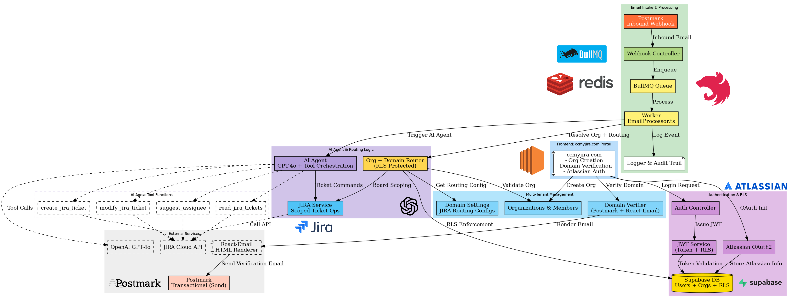
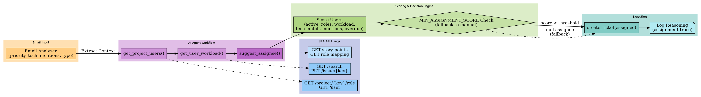
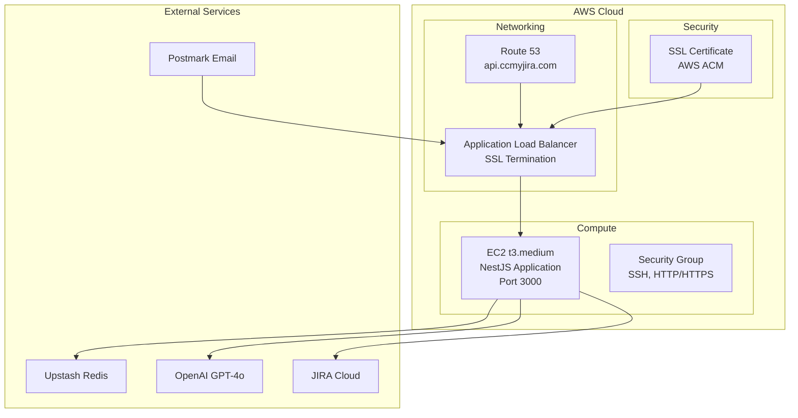

# AI-Powered Email Processing System for Postmark Challenge

[](https://nestjs.com/)
[](https://www.typescriptlang.org/)
[](https://openai.com/)
[](https://postmarkapp.com/)

> **🏆 Postmark Challenge Submission**: An innovative AI-powered email-to-JIRA system that transforms customer support workflows using Postmark's inbound email parsing.

## 🚀 Live Demo - Try It Now!

**No setup required - the system is live and ready to test:**

- **🌐 Live API**: https://api.ccmyjira.com
- **📚 Interactive API Docs**: https://api.ccmyjira.com/api/docs  
- **🏥 Health Check**: https://api.ccmyjira.com/api/dashboard/health
- **📧 Test Webhook**: Send POST to https://api.ccmyjira.com/webhooks/postmark

## 📸 System Architecture


*Complete AI-powered email processing workflow with Postmark integration*

 
*AI-powered smart assignment using team workload and skill analysis*

## 🎯 What Makes This Special

This system revolutionizes email-to-ticket workflows by combining Postmark's reliable email parsing with GPT-4o's intelligence:

### 🧠 **Intelligent Email Understanding**
- **GPT-4o Analysis**: Understands context, urgency, and technical content
- **Smart Decisions**: Creates new tickets vs. updates existing ones intelligently
- **Attachment Processing**: Screenshots, logs, documents automatically handled
- **Context Preservation**: Maintains email threading and rich formatting

### 👥 **AI-Powered Team Assignment**
- **Workload Balancing**: Distributes work based on current capacity
- **Skill Matching**: Routes React bugs to frontend developers
- **Priority Routing**: Critical issues go to senior team members
- **Mention Recognition**: Honors @mentions and specific assignments

### ⚡ **Production-Ready Performance**
- **Instant Response**: 200 OK to Postmark in <100ms
- **Scalable Processing**: Redis queue with configurable workers
- **Error Resilience**: Comprehensive retry and fallback strategies

## 📧 Postmark Integration

### **Core Features Utilized**

#### 🎯 **Inbound Email Parsing** (Primary Feature)
```typescript
@Post('postmark')
async handlePostmarkWebhook(@Body() payload: PostmarkWebhookDto) {
  const emailData = {
    from: payload.From,
    subject: payload.Subject,
    htmlBody: payload.HtmlBody,      // Rich content
    textBody: payload.TextBody,      // Fallback
    attachments: payload.Attachments, // All files
    messageId: payload.MessageID
  };
  
  await this.queueService.addEmailJob(emailData);
  return { success: true }; // Immediate response
}
```

#### 📎 **Advanced Attachment Processing**
- **All file types**: Images, PDFs, logs, code files, archives
- **Embedded images**: Extracts `cid:` references from HTML emails
- **Auto-upload**: Seamlessly transfers to JIRA tickets
- **Context analysis**: AI considers attachment types for categorization

#### 🔐 **Enterprise Security**
- **Webhook validation**: Strict payload verification
- **Size handling**: Supports up to 50MB payloads
- **Error recovery**: Graceful failure handling

### **Why Postmark Was Essential**
1. **🚀 Reliability**: 99.9% webhook delivery success
2. **📊 Rich Data**: Complete email metadata extraction
3. **🔧 Developer UX**: Clean API and excellent documentation
4. **⚡ Performance**: Fast delivery enables real-time processing
5. **🛡️ Security**: Built-in spam filtering and validation

## 🛠️ Quick Start

### Option 1: Test Live System (Instant)
```bash
# Test the live webhook
curl -X POST https://api.ccmyjira.com/webhooks/postmark \
  -H "Content-Type: application/json" \
  -d '{
    "From": "test@example.com",
    "Subject": "Bug: React component crash",
    "TextBody": "The login component crashes on mobile",
    "MessageID": "test-123"
  }'
```

### Option 2: Local Setup
```bash
# Prerequisites: Node.js 18+, Redis, OpenAI key, JIRA access
git clone <repository-url>
cd server
pnpm install

# Configure
cp .env.example .env
# Add: OPENAI_API_KEY, JIRA_*, REDIS_*, POSTMARK_*

# Start
docker-compose up -d
# or: pnpm run start:dev
```

## 🏗️ Key Features

### 🤖 **AI-Powered Intelligence**
- **Email Analysis**: GPT-4o understands context and technical content
- **Non-linear Processing**: Updates existing tickets when appropriate
- **Smart Assignment**: Routes based on skills, workload, and mentions
- **Multi-round Conversations**: Complex workflows with tool calling

### 🎫 **Advanced JIRA Integration**
- **Search-first Approach**: Prevents duplicate tickets
- **Sprint Awareness**: Automatic assignment and due dates
- **Rich Formatting**: Preserves email styling in descriptions
- **Attachment Handling**: Automatic file uploads with context

### ⚡ **Production Architecture**
- **Immediate Response**: Instant 200 OK to webhooks
- **Background Processing**: Scalable Redis queue system
- **Rate Limiting**: Intelligent JIRA API management
- **Error Handling**: Comprehensive retry strategies

## 🌐 AWS Production Deployment



**Simple, scalable architecture:**
- **DNS**: Route 53 → ALB → EC2
- **Security**: SSL termination, security groups
- **Compute**: Single t3.medium instance (easily scalable)
- **External**: Managed services for reliability

---

**🏆 Built for Postmark Challenge** | [Live Demo](https://api.ccmyjira.com) | [API Docs](https://api.ccmyjira.com/api/docs) | [Challenge Link](https://dev.to/devteam/join-the-postmark-challenge-inbox-innovators-3000-in-prizes-497l)
