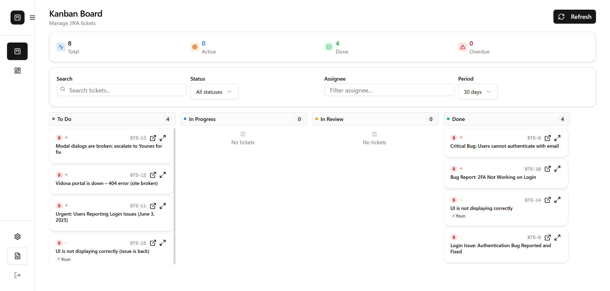
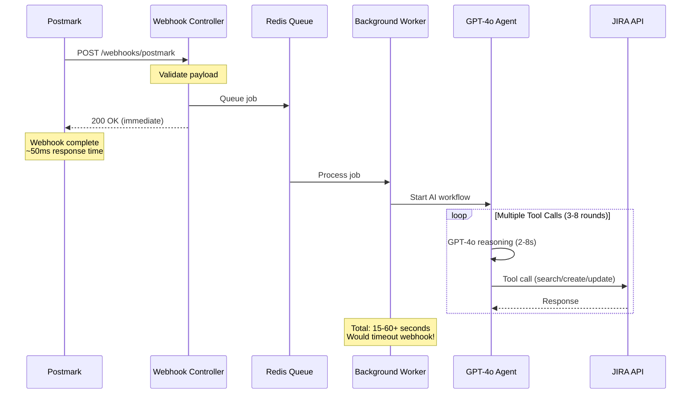
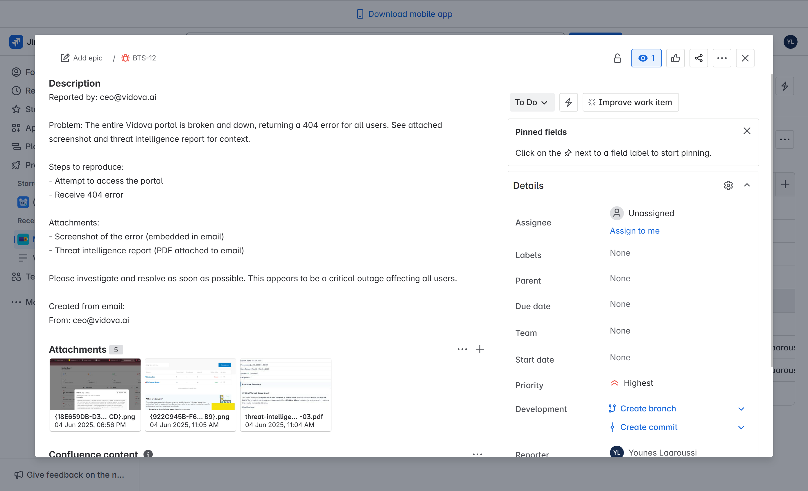
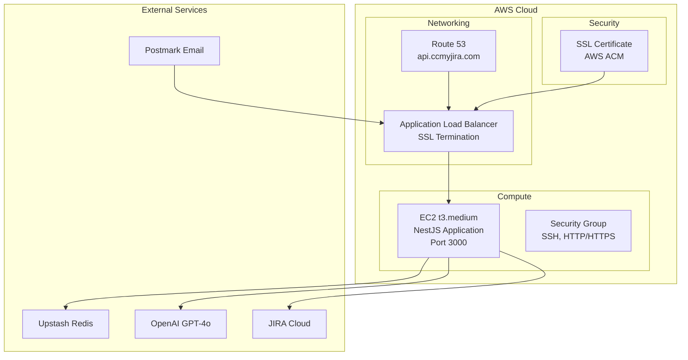

# AI-Powered Email-to-JIRA SaaS (Postmark Challenge)

[](https://nestjs.com/)
[](https://www.typescriptlang.org/)
[](https://openai.com/)
[](https://postmarkapp.com/)
[](https://docs.bullmq.io/)

**🏆 Built for Postmark Challenge** | [Live Demo](https://api.ccmyjira.com) | [API Docs](https://api.ccmyjira.com/api/docs) | [Challenge Link](https://dev.to/devteam/join-the-postmark-challenge-inbox-innovators-3000-in-prizes-497l)

---

## 🏗️ Architecture


---

## 🚀 Try It Now (Live Demo)

### 🟢 No Atlassian Account Needed (Demo Mode)
| Step | Action |
|------|--------|
| 1 | Go to [ccmyjira.com](https://ccmyjira.com) |
| 2 | Click "Use Demo Account" during onboarding |
| 3 | Send an email from **any email address** to `hello@send.ccmyjira.com` |
| 4 | See the ticket and attachments appear live in the demo JIRA board UI |

### 🔒 With Your Atlassian Account (Full SaaS Flow)
| Step | Action |
|------|--------|
| 1 | Go to [ccmyjira.com](https://ccmyjira.com) |
| 2 | Authenticate with your Atlassian account |
| 3 | Verify your **company domain** (no public email providers like gmail) |
| 4 | Configure your JIRA board (project, users, sprints) |
| 5 | Send an email from your **verified domain** to `hello@send.ccmyjira.com` (or use forwarding/CC/reply-all) |
| 6 | Watch tickets and attachments appear live in your JIRA board UI |



**Note:** For authenticated orgs, only emails sent from your verified domain are accepted and routed to your JIRA.


---

## 📧 Postmark Features & Integration

| Postmark Feature | How We Use It |
|------------------|--------------|
| **Inbound Webhooks** | All incoming emails to `hello@send.ccmyjira.com` are parsed and POSTed to our API for processing (attachments, HTML, etc). |
| **Immediate Response** | Webhook returns 200 OK instantly, then processes via Redis/BullMQ background jobs - prevents Postmark timeouts |
| **Outbound Email** | Sends domain verification emails (React Email templates) and JIRA notifications from `noreply@ccmyjira.com`. |
| **Inbound Domain Forwarding** | We use Postmark's inbound domain to use our own address: send.ccmyjira.com |
| **Custom Sender Domain** | All outbound emails use our verified sender domain: `noreply@ccmyjira.com`. |

### 🚀 Webhook Processing Architecture



**Why This Matters for Postmark:**
- **AI Processing Takes 15-60+ Seconds**: Our GPT-4o agent makes 3-8 tool calls per email (search JIRA → analyze → create/update → assign). Each OpenAI API call takes 2-8 seconds, plus JIRA API calls.
- **Webhook Timeout Prevention**: Postmark expects responses under 10 seconds - we respond in ~50ms, then let background workers handle the heavy AI processing
- **Horizontal Scaling**: Can run multiple BullMQ workers across containers/servers. High email volumes automatically distribute across available workers.
- **Reliable Delivery**: Failed AI processing doesn't affect email receipt acknowledgment - emails never get lost
- **Error Resilience**: Background jobs retry with exponential backoff if OpenAI hits rate limits or JIRA APIs are slow

---

## 🏗️ Key Features



| Category | Feature | Description |
|----------|---------|-------------|
| 🤖 **AI-Powered Intelligence** | Email Analysis | GPT-4o understands context and technical content |
| | Non-linear Processing | Updates existing tickets when appropriate |
| | Smart Assignment | Routes based on skills, workload, and mentions |
| | Multi-round Conversations | Complex workflows with tool calling |
| 🎫 **Advanced JIRA Integration** | Search-first Approach | Prevents duplicate tickets |
| | Sprint Awareness | Automatic assignment and due dates |
| | Rich Formatting | Preserves email styling in descriptions |
| | Attachment Handling | Automatic file uploads with context |
| ⚡ **Production Architecture** | Immediate Response | Instant 200 OK to webhooks |
| | Background Processing | Scalable Redis queue system |
| | Rate Limiting | Intelligent JIRA API management |
| | Error Handling | Comprehensive retry strategies |
| 🔒 **Multi-Tenant Security** | Row Level Security (RLS) | Database-level tenant isolation with PostgreSQL policies |
| | Domain Verification | Only verified company domains can create tickets |
| | Encrypted Tokens | Atlassian OAuth tokens encrypted at rest with tenant-specific keys |
| | Request Isolation | Every API call validates tenant context before data access |
| ♿ **Accessibility** | Email Processing | Works with any email client including screen reader accessible ones |
| | API-First Design | Clean REST APIs enable accessible frontend implementations |
| | Semantic Structure | Email content preserved with proper formatting for assistive tech |

---

## 🔐 Enterprise-Grade Multi-Tenant Security

### Domain-Based Email Routing
```typescript
// Actual implementation from domain-lookup.service.ts
const { data: domainConfig, error: domainError } = await this.supabaseService.client
  .from('domain_configurations')
  .select(`
    *,
    organization:organizations!inner(
      id, name, jira_base_url, jira_project_key, jira_cloud_id, owner_id
    )
  `)
  .eq('domain', domain)
  .eq('verification_status', 'verified')
  .single();
```

| Security Layer | Implementation | Postmark Integration |
|----------------|----------------|---------------------|
| **Domain Verification** | Multi-step verification process with email confirmation via Postmark | Only emails from verified domains create tickets in corresponding tenant |
| **Supabase RLS** | Built-in Supabase Row Level Security isolates tenant data automatically | Prevents cross-tenant data access at database level |
| **Token Management** | Atlassian OAuth tokens stored securely in Supabase with refresh handling | Tokens scoped per organization preventing cross-tenant access |
| **Request Context** | Domain lookup validates sender before processing | Webhook processing includes tenant lookup from sender domain |
| **Demo Mode Fallback** | Secure demo environment when domain verification unavailable | Unknown domains route to isolated demo JIRA instance |

### Postmark Security Integration
- **Webhook Validation**: HMAC signature verification for all inbound emails
- **Domain-Based Routing**: Only emails from verified domains create tickets in corresponding tenant
- **SPF/DKIM Enforcement**: Postmark's built-in email authentication prevents spoofing
- **Attachment Scanning**: All attachments validated for malicious content before JIRA upload

---

## 🤖 AI Agent Capabilities

| Capability | Description |
|------------|-------------|
| **Context Awareness** | Tracks email threads, avoids duplicate tickets, updates existing tickets as needed |
| **Assignment & Roles** | Fetches org users/roles, assigns tickets, updates metadata (priority, status), manages sprints |
| **Multi-Message Chains** | Handles long email histories, not just single messages |
| **Smart Actions** | Decides when to create, update, assign, or comment on tickets |

---

### 🎯 Smart Assignment System


Our AI agent doesn't just create tickets—it intelligently assigns them based on:

| Factor | How It Works |
|--------|-------------|
| **Team Workload** | Analyzes current ticket counts, story points, and overdue items per team member |
| **Skill Matching** | Routes React bugs to frontend developers, database issues to backend specialists |
| **Priority Routing** | Critical P0 issues automatically go to senior team members |
| **@Mention Recognition** | Honors explicit assignments when team members are mentioned in emails |
| **Sprint Context** | Considers active sprints and capacity when making assignments |

**A trace of the agent's actions is logged to console when you run in dev mode!**

---

## 📝 Prerequisites & Local Setup

| Requirement | Details |
|-------------|---------|
| Node.js     | 18+     |
| Redis       | Any     |
| OpenAI API  | Key     |
| JIRA Cloud  | Access  |
| Postmark    | Account |

```bash
# Clone and install
git clone <repository-url>
cd server
pnpm install

# Configure
touch .env # or cp .env.example .env
# Add: OPENAI_API_KEY, JIRA_*, REDIS_*, POSTMARK_*

# Start
docker-compose up -d
# or: pnpm run start:dev
```

## 🌐 AWS Production Deployment



**Simple, scalable architecture:**
- **DNS**: Route 53 → ALB → EC2
- **Security**: SSL termination, security groups
- **Compute**: Single t3.medium instance (easily scalable)
- **External**: Managed services for reliability

