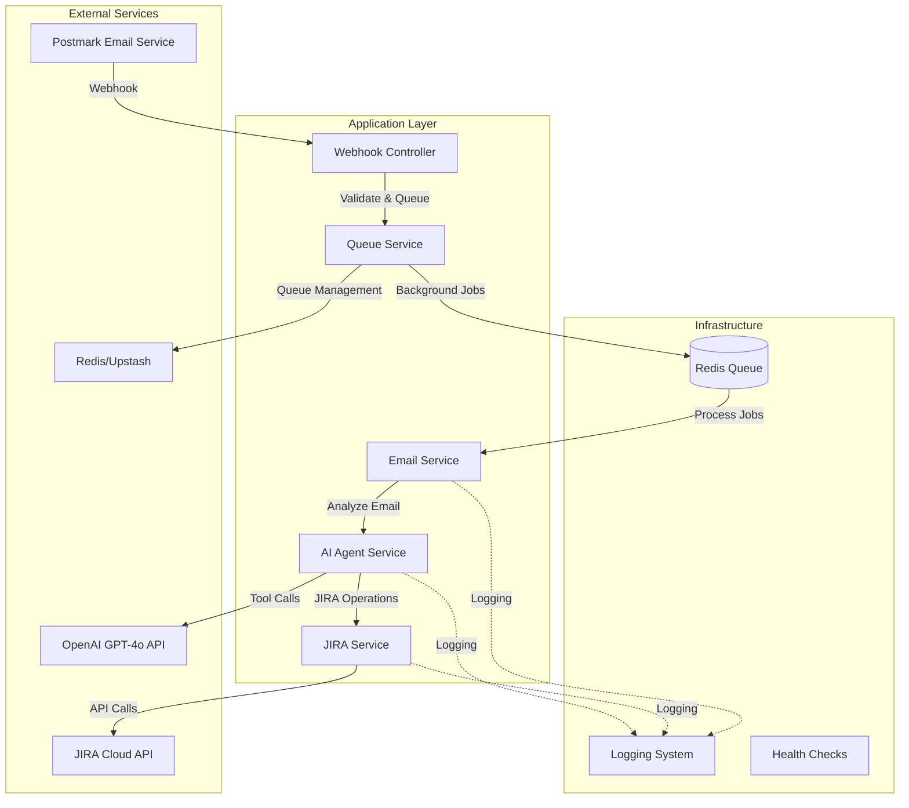

# 🏗️ System Architecture

This document provides a comprehensive technical overview of the AI-powered email processing system's architecture, component relationships, and design decisions.

## 📋 Table of Contents

- [High-Level Architecture](#high-level-architecture)
- [Component Architecture](#component-architecture)
- [Data Flow](#data-flow)
- [Module Structure](#module-structure)
- [Technology Stack](#technology-stack)
- [Design Patterns](#design-patterns)
- [Performance Considerations](#performance-considerations)
- [Security Architecture](#security-architecture)

## 🎯 High-Level Architecture



## 🔧 Component Architecture

### 1. **Email Processing Layer**

```typescript
┌─────────────────────────────────────────────────┐
│                Email Module                     │
├─────────────────────────────────────────────────┤
│ • EmailController                               │
│   - POST /webhooks/postmark                     │
│   - POST /webhooks/test                         │
│ • EmailService                                  │
│   - Payload validation                          │
│   - Email parsing                               │
│   - Queue job creation                          │
│ • DTOs                                          │
│   - PostmarkWebhookDto                          │
│   - EmailProcessingJobDto                       │
└─────────────────────────────────────────────────┘
```

**Key Responsibilities:**
- Receive Postmark webhooks with immediate 200 OK response
- Validate email payload structure and content
- Extract email metadata (sender, subject, body, attachments)
- Queue background processing jobs
- Handle webhook security and validation

### 2. **Queue Processing Layer**

```typescript
┌─────────────────────────────────────────────────┐
│                Queue Module                     │
├─────────────────────────────────────────────────┤
│ • QueueService                                  │
│   - Job creation and management                 │
│   - Queue configuration                         │
│   - Worker scaling                              │
│ • EmailProcessor                                │
│   - Background job processing                   │
│   - Error handling and retries                 │
│   - AI agent orchestration                     │
│ • Queue Configuration                           │
│   - BullMQ setup                               │
│   - Redis connection                            │
│   - Retry strategies                            │
└─────────────────────────────────────────────────┘
```

**Key Responsibilities:**
- Asynchronous job processing with BullMQ
- Configurable concurrency and scaling
- Retry mechanisms with exponential backoff
- Job status tracking and monitoring
- Worker health management

### 3. **AI Agent Layer**

```typescript
┌─────────────────────────────────────────────────┐
│              AI Agent Module                    │
├─────────────────────────────────────────────────┤
│ • AiAgentService                                │
│   - GPT-4o conversation management              │
│   - Multi-round tool calling                   │
│   - Context preservation                        │
│ • Tool Definitions                              │
│   - get_current_period                          │
│   - read_jira_tickets                           │
│   - create_jira_ticket                          │
│   - modify_jira_ticket                          │
│   - get_sprints (optional)                      │
│   - get_active_sprint (optional)                │
│ • Conversation Flow                             │
│   - System prompt management                    │
│   - Message history tracking                    │
│   - Tool result integration                     │
└─────────────────────────────────────────────────┘
```

**Key Responsibilities:**
- Orchestrate complex AI workflows
- Manage multi-round conversations with GPT-4o
- Execute tool calls based on AI decisions
- Maintain conversation context and history
- Implement intelligent decision-making logic

### 4. **JIRA Integration Layer**

```typescript
┌─────────────────────────────────────────────────┐
│               JIRA Module                       │
├─────────────────────────────────────────────────┤
│ • JiraService                                   │
│   - REST API client                             │
│   - Rate limiting                               │
│   - Error handling                              │
│ • Ticket Operations                             │
│   - createTicket()                              │
│   - updateTicket()                              │
│   - searchTickets()                             │
│   - getTicket()                                 │
│ • Sprint Operations (optional)                  │
│   - getSprints()                                │
│   - getActiveSprint()                           │
│   - assignToSprint()                            │
│ • API Management                                │
│   - Authentication handling                     │
│   - Request/response transformation             │
│   - Retry logic                                 │
└─────────────────────────────────────────────────┘
```

**Key Responsibilities:**
- Comprehensive JIRA Cloud API integration
- Intelligent ticket lifecycle management
- Sprint-aware operations (when enabled)
- Rate limiting and API quota management
- Error resilience and retry strategies

## 🌊 Data Flow

### 1. **Email Reception Flow**

```
[Postmark] → [Webhook] → [Validation] → [Queue] → [200 OK]
     ↓
[Email Payload] → [Extract Metadata] → [Create Job] → [Redis Queue]
```

**Steps:**
1. Postmark sends webhook to `/webhooks/postmark`
2. Controller validates payload structure
3. Service extracts email metadata
4. Job queued for background processing
5. Immediate 200 OK response to Postmark

### 2. **Background Processing Flow**

```
[Redis Queue] → [Job Processor] → [AI Agent] → [Tool Calls] → [JIRA Actions]
       ↓              ↓              ↓             ↓             ↓
   [Job Data] → [Email Analysis] → [GPT-4o] → [Tool Results] → [Ticket Updates]
```

**Steps:**
1. Queue worker picks up job from Redis
2. Email processor invokes AI agent
3. AI agent analyzes email content
4. Multi-round conversation with GPT-4o
5. Tool calls executed based on AI decisions
6. JIRA operations performed
7. Results logged and tracked

### 3. **AI Decision Flow**

```
[Email Content] → [System Prompt] → [GPT-4o Analysis] → [Tool Selection]
      ↓                ↓                 ↓                  ↓
[Context] → [Conversation History] → [AI Response] → [Tool Execution]
      ↓                ↓                 ↓                  ↓
[Results] → [Update History] → [Continue/Complete] → [Final Summary]
```

**Decision Logic:**
1. **Search First**: Always search existing JIRA tickets
2. **Analyze Context**: Understand email content and intent
3. **Make Decision**: Create new vs update existing vs comment
4. **Execute Actions**: Perform selected JIRA operations
5. **Provide Summary**: Return processing results

## 📁 Module Structure

```
src/
├── 📁 ai-agent/
│   ├── ai-agent.module.ts          # AI Agent module definition
│   ├── ai-agent.service.ts         # Core AI processing logic
│   └── interfaces/
│       ├── email-processing.interface.ts
│       └── tool-definitions.interface.ts
│
├── 📁 email/
│   ├── email.module.ts             # Email module definition
│   ├── email.controller.ts         # Webhook endpoints
│   ├── email.service.ts            # Email processing logic
│   └── dto/
│       ├── postmark-webhook.dto.ts
│       └── email-processing-job.dto.ts
│
├── 📁 jira/
│   ├── jira.module.ts              # JIRA module definition
│   ├── jira.service.ts             # JIRA API integration
│   └── interfaces/
│       ├── jira-ticket.interface.ts
│       ├── jira-sprint.interface.ts
│       └── jira-api.interface.ts
│
├── 📁 queue/
│   ├── queue.module.ts             # Queue module definition
│   ├── queue.service.ts            # Queue management
│   └── processors/
│       └── email.processor.ts      # Background job processor
│
├── 📁 common/
│   ├── filters/                    # Exception filters
│   ├── interceptors/               # Request/response interceptors
│   ├── guards/                     # Route guards
│   └── decorators/                 # Custom decorators
│
├── app.module.ts                   # Root application module
└── main.ts                         # Application bootstrap
```

## 🛠️ Technology Stack

### **Core Framework**
- **NestJS**: Modular, scalable Node.js framework
- **TypeScript**: Type-safe development
- **Express**: HTTP server foundation

### **AI & Processing**
- **OpenAI SDK**: GPT-4o integration
- **BullMQ**: Advanced queue system
- **Redis**: In-memory data store and queue backend

### **External Integrations**
- **JIRA REST API**: Issue tracking integration
- **Postmark**: Email webhook processing
- **Upstash Redis**: Managed Redis service

### **Development & Operations**
- **pnpm**: Fast package manager
- **Jest**: Testing framework
- **Docker**: Containerization
- **Winston**: Logging framework

## 🎨 Design Patterns

### 1. **Dependency Injection**
```typescript
@Injectable()
export class AiAgentService {
  constructor(
    private readonly configService: ConfigService,
    private readonly jiraService: JiraService,
  ) {}
}
```

### 2. **Factory Pattern**
```typescript
// Tool definitions factory
private getToolDefinitions() {
  const sprintsEnabled = this.configService.get<string>('ENABLE_SPRINTS') === 'true';
  return sprintsEnabled ? [...baseTools, ...sprintTools] : baseTools;
}
```

### 3. **Strategy Pattern**
```typescript
// Different AI processing strategies based on email type
switch (emailType) {
  case 'bug_report': return this.processBugReport(email);
  case 'feature_request': return this.processFeatureRequest(email);
  case 'general': return this.processGeneralEmail(email);
}
```

### 4. **Observer Pattern**
```typescript
// Queue job events
processor.on('completed', (job) => {
  this.logger.log(`Job ${job.id} completed`);
});

processor.on('failed', (job, err) => {
  this.logger.error(`Job ${job.id} failed: ${err.message}`);
});
```

## ⚡ Performance Considerations

### **Asynchronous Processing**
- Immediate webhook responses (< 100ms)
- Background job processing prevents blocking
- Configurable worker concurrency

### **Resource Optimization**
- Connection pooling for Redis and HTTP clients
- Rate limiting for external APIs
- Memory-efficient job processing

### **Scalability Features**
- Horizontal worker scaling
- Queue-based load distribution
- Stateless service design

### **Error Resilience**
- Exponential backoff retry strategies
- Circuit breaker patterns
- Graceful degradation

## 🔒 Security Architecture

### **Input Validation**
- DTO-based payload validation
- Email content sanitization
- Parameter type checking

### **Authentication & Authorization**
- JIRA API token management
- Secure environment variable handling
- Service-to-service authentication

### **Network Security**
- HTTPS-only communications
- IP whitelisting for webhooks
- Rate limiting and DDoS protection

### **Data Protection**
- No sensitive data storage
- Secure logging practices
- PII handling compliance

## 🔗 Related Documentation

- **[Installation & Setup](02-installation.md)** - Set up your development environment
- **[Configuration](03-configuration.md)** - Configure system settings
- **[AI Agent System](04-ai-agent.md)** - Deep dive into AI processing
- **[Queue System](07-queue-system.md)** - Background job processing details

---

**Next**: Learn how to set up and configure the system in [Installation & Setup](02-installation.md). 