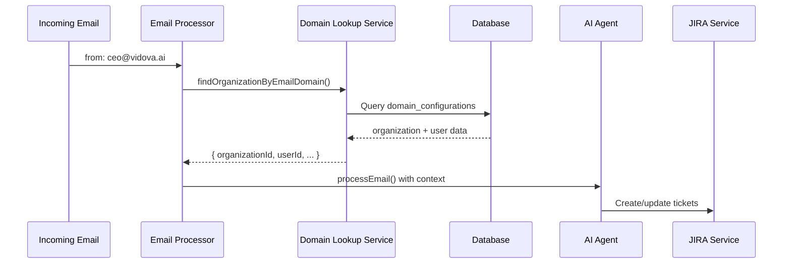

# Domain Mapping Solution

## Problem
The email processing system was receiving emails but couldn't map them to JIRA boards because the domain-to-organization mapping wasn't implemented in the email processor.

## Root Cause
The `EmailProcessor` was calling `aiAgentService.processEmail()` without providing `userId` and `organizationId` fields, which are required to enable JIRA operations.

## Solution Overview

### 1. **Domain Lookup Service** (`src/domain/domain-lookup.service.ts`)
- Extracts domain from email address (`user@example.com` → `example.com`)
- Queries `domain_configurations` table for verified domains
- Returns organization and user context if domain is verified

### 2. **Updated Email Processor** (`src/queue/processors/email.processor.ts`)
- Uses `DomainLookupService` to find organization/user context
- Passes context to AI agent to enable JIRA operations
- Provides clear logging for debugging

### 3. **Debug Endpoints** (`src/domain/domain.controller.ts`)
- Test domain lookup functionality
- Check verification status
- List all verified domains

## How It Works



## Implementation Steps

### 1. Domain Configuration Required
Before emails can be processed with JIRA integration, the domain must be:
1. **Added** to an organization
2. **Verified** via email confirmation
3. **Linked** to JIRA configuration

### 2. Verification Process
```sql
-- Check if domain is verified
SELECT * FROM domain_configurations 
WHERE domain = 'vidova.ai' 
AND verification_status = 'verified';

-- See organization details
SELECT 
  dc.domain,
  dc.verification_status,
  org.name,
  org.jira_base_url,
  org.jira_project_key
FROM domain_configurations dc
JOIN organizations org ON dc.organization_id = org.id
WHERE dc.domain = 'vidova.ai';
```

## Testing the Solution

### 1. Check Domain Verification Status
```bash
curl "http://localhost:3000/domain/check/vidova.ai"
```

### 2. Test Domain Lookup
```bash
curl "http://localhost:3000/domain/lookup/ceo@vidova.ai"
```

### 3. List All Verified Domains
```bash
curl "http://localhost:3000/domain/verified"
```

### 4. Process Test Email
Send a test email through Postmark webhook and check logs for:
```
🔍 Looking up organization for domain: vidova.ai
🏢 Found organization: Vidova AI (org-uuid)
👤 Using user: CEO Name (user-uuid)
✅ JIRA integration available for organization: org-uuid
```

## Expected Log Output

### Before Fix (No JIRA Integration)
```
[AiAgentService] Processing email with AI: Re:
[AiAgentService] No user/organization context provided - JIRA operations will be disabled
```

### After Fix (With JIRA Integration)
```
[EmailProcessor] Processing email from: ceo@vidova.ai, subject: Re:
[DomainLookupService] 🔍 Looking up organization for domain: vidova.ai
[DomainLookupService] ✅ Domain lookup successful: vidova.ai → Org: Vidova AI (org-id), User: CEO (user-id)
[EmailProcessor] 🏢 Found organization: Vidova AI (org-id)
[EmailProcessor] 👤 Using user: CEO Name (user-id)
[AiAgentService] Processing email with AI: Re:
[AiAgentService] ✅ JIRA integration available for organization: org-id
```

## Troubleshooting

### Domain Not Found
If you see:
```
⚠️ No verified domain configuration found for email: ceo@vidova.ai
💡 JIRA operations will be disabled. To enable JIRA integration, the domain needs to be verified.
```

**Solution:**
1. Verify the domain is in `domain_configurations` table
2. Check `verification_status = 'verified'`
3. Ensure organization has JIRA configuration
4. Use debug endpoints to diagnose

### Common Issues

1. **Domain Not Verified**
   - Use `/auth/verify-domain/initiate` API
   - Check verification email
   - Confirm via email link or manual code

2. **Organization Missing JIRA Config**
   - Ensure `jira_base_url` and `jira_project_key` are set
   - Verify Atlassian OAuth tokens are valid

3. **Database Connection Issues**
   - Check Supabase configuration
   - Verify `SUPABASE_URL` and `SUPABASE_ANON_KEY`

## API Endpoints

### Debug Endpoints
- `GET /domain/lookup/:email` - Test domain lookup
- `GET /domain/verified` - List verified domains  
- `GET /domain/check/:domain` - Check verification status

### Production Endpoints
- `POST /auth/verify-domain/initiate` - Start verification
- `POST /auth/verify-domain/confirm` - Complete verification
- `GET /auth/domains/status` - Check organization domains

## Security Notes

- Domain verification prevents unauthorized email routing
- Only verified domains can trigger JIRA operations
- Organization owners are used as default context
- All operations are logged for audit trails

## Next Steps

1. **Test with Real Email**: Send email from verified domain
2. **Monitor Logs**: Check for successful domain lookup
3. **Verify JIRA Integration**: Confirm tickets are created
4. **Add More Domains**: Verify additional domains as needed 